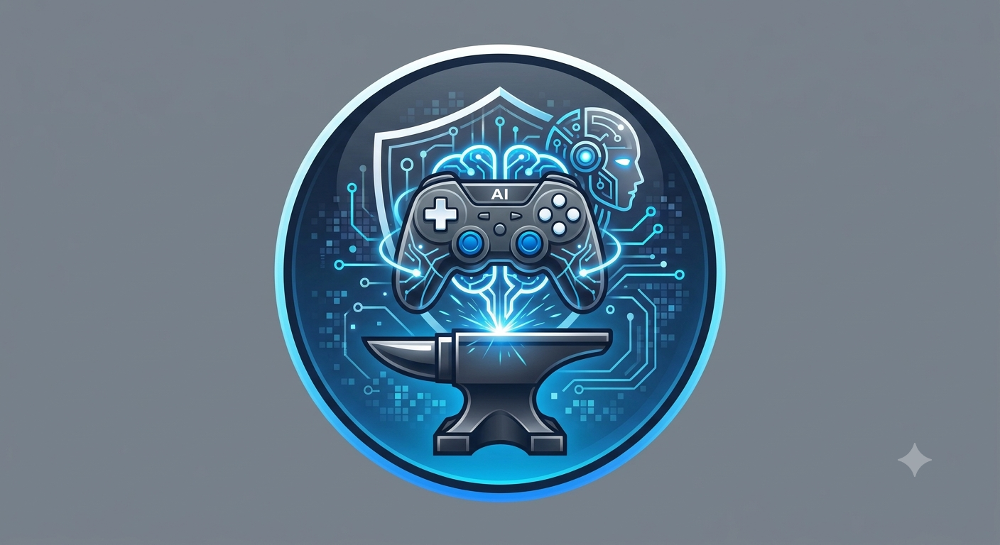

<p align="center">
  
</p>

<h1 align="center">ForgeGameIA</h1>
<p align="center"><b>Un studio de jeu vidéo piloté par une équipe d'agents IA — 100% gratuit et open source.</b></p>

---

## Qu'est-ce que c'est ?

ForgeGameIA est un studio de développement de jeu vidéo simulé par des
agents IA, piloté depuis une simple app de chat. Tu décris ce que tu veux
(un niveau, un scénario, une ambiance sonore...), un **Manager IA** route
la demande vers l'agent spécialisé du studio le plus pertinent — et peut
créer de nouveaux sous-agents à la volée pour des besoins précis ou des
tâches répétitives.

Le jeu produit est un **tactical-RPG isométrique 3D** (façon *Final
Fantasy Tactics*) : combat au tour par tour, relief, unités avec stats,
sur un moteur **Godot** open source.

Propriété de **Vip Serrurerie** — voir [`LICENSE`](./LICENSE).

## Aperçu du fonctionnement

```
Toi → App de chat ForgeGameIA → Manager IA → agent du studio → réponse / niveau généré
                                                                        ↓
                                                          App du jeu (Godot) → simulation jouable
```

## L'équipe du studio

Un **Manager** au sommet, 11 grands agents en dessous de lui, et des
sous-agents qu'il peut créer lui-même selon les besoins (toujours
rattachés à un grand agent, jamais directement au Manager) :

| Agent | Rôle |
|---|---|
| 🎯 Manager | Coordonne l'équipe, route les demandes, crée des sous-agents |
| 🎮 Game Designer | Génère les niveaux jouables (grille, unités, objectif) |
| 🗺️ Level Designer | Affine le relief et les obstacles d'une carte |
| 📖 Narrative Designer | Scénario, dialogues, quêtes |
| 🎨 Directeur Artistique | Direction visuelle, palette, ambiance |
| 🎵 Sound Designer | Ambiance sonore, musique |
| 💻 Programmeur Gameplay | Notes techniques d'implémentation |
| 🌐 Technicien Réseaux & Compatibilité | Diagnostic connexion/hébergement/compatibilité |
| 🔭 Visionnaire | Direction créative à long terme |
| 🛡️ Contrôleur de Code & Rendu 3D | Relecture de code Godot, qualité du rendu |
| 🧭 Ergonomie / UX | Utilisabilité de l'interface et du jeu |
| ⚡ Optimisation Temps Réel | Surveille la performance de l'app elle-même |

## Fonctionnalités

- 💬 **Chat multi-agents** avec pièces jointes (image, PDF, texte) comme référence
- 📁 **Jusqu'à 5 projets en parallèle**, chacun avec son propre historique de niveaux
- 📜 **Historique de niveaux** — réactive n'importe quelle carte générée précédemment
- ⚔️ **Combat au tour par tour jouable** : sélection, déplacement, attaque, IA ennemie, victoire/défaite
- 📚 **Apprentissage web** : le Manager peut faire une vraie recherche Google pour affiner sa connaissance du métier de studio
- 🎮 **Lancement direct** du jeu compilé depuis le chat, avec le dernier niveau chargé automatiquement
- 🌙 **File d'attente nocturne** : dépose des prompts (bouton 🌙) traités automatiquement chaque nuit par un workflow gratuit programmé — les agents déposent leurs réponses, jamais de modification de code automatique
- 🧠 **Persistance complète** (Supabase) : rien ne se perd au redémarrage du serveur

## Stack technique — 100% gratuite et open source

| Composant | Techno | Licence / coût |
|---|---|---|
| Backend | FastAPI (Python) | MIT, hébergement gratuit (Render) |
| IA principale | Google Gemini | Gratuit (quota quotidien) |
| IA de secours | Groq (modèles open source Llama) | Gratuit |
| Base de données | Supabase (Postgres) | Gratuit en permanence |
| Jeu | Godot 4 | MIT |
| App de chat | HTML/JS statique | Hébergement GitHub Pages gratuit |
| Compilation Android | GitHub Actions | Gratuit |

Seul coût possible : dépassement des quotas gratuits Gemini/Groq en cas
d'usage très intensif (peu probable en usage personnel).

## Structure du dépôt

```
backend/          → serveur FastAPI (agents, routage, persistance)
forge_web/         → app de chat (web + APK via Web to App / Capacitor)
game_godot/         → projet Godot du jeu
assets/             → logo et visuels du projet
render.yaml         → configuration automatique du backend sur Render
```

## Installation — dans l'ordre

1. **Base de données** : crée un projet sur [supabase.com](https://supabase.com), puis dans l'éditeur SQL :
   ```sql
   create table kv_store (key text primary key, value jsonb);
   ```
   Note l'URL du projet et la clef "anon public" (Settings → API).

2. **Clef Gemini (gratuite)** : sur [aistudio.google.com](https://aistudio.google.com) → "Get API key".

3. **Clef Groq (gratuite, secours)** : sur [console.groq.com](https://console.groq.com) → "API Keys" → "Create API Key".

4. **Backend sur Render** : onglet **Blueprints** → **New Blueprint Instance** → sélectionne ce dépôt. Render détecte `render.yaml` et déploie automatiquement en gratuit. Renseigne les 4 clefs demandées (Gemini, Groq, Supabase URL, Supabase Key).

5. **Brancher l'URL du backend** : remplace `BACKEND_URL` dans `forge_web/index.html` et `game_godot/Main.gd` par l'URL donnée par Render.

6. **App de chat** : active GitHub Pages (Settings → Pages → branche `main` → `/root`), ouvre `forge_web/index.html` depuis l'URL générée — ou empaquette-la en APK avec l'app "Web to App".

7. **Le jeu** : récupère l'APK compilé automatiquement dans l'onglet **Actions** → "Build ForgeGameIA APK" → Artifacts, ou ouvre `game_godot/` directement dans l'éditeur Godot mobile.

8. **(Optionnel) File d'attente nocturne** : dans Render → Environment → ajoute `QUEUE_SECRET` (une phrase secrète de ton choix). Dans GitHub → Settings du dépôt → "Secrets and variables" → "Actions" → ajoute `BACKEND_URL` (ton URL Render) et `QUEUE_SECRET` (la même valeur). Un workflow programmé traitera chaque nuit jusqu'à 5 prompts déposés via le bouton 🌙 de l'app.

## Limites actuelles, en toute transparence

- **Pas de vrais graphismes ni de musique originale** — les unités et le terrain restent des formes géométriques colorées. Ça demanderait un artiste humain ou des API de génération payantes.
- **Serveur gratuit Render qui se met en veille** après inactivité (premier message après une pause : 30-50s de délai).
- **Quotas gratuits limités** sur Gemini — le secours Groq prend le relais automatiquement si besoin, mais sans pièces jointes ni recherche web dans ce mode.
- **Pas de pilotage à distance de l'éditeur Godot** — le bouton "Lancer la simulation" ouvre le jeu déjà compilé, pas l'éditeur lui-même (aucune API Android ne permet ça de façon fiable).

## Licence

© 2026 Vip Serrurerie — Tous droits réservés. Voir [`LICENSE`](./LICENSE).
Ce projet utilise des outils tiers open source sous leurs licences
respectives (majoritairement MIT) — voir la section Stack ci-dessus.
